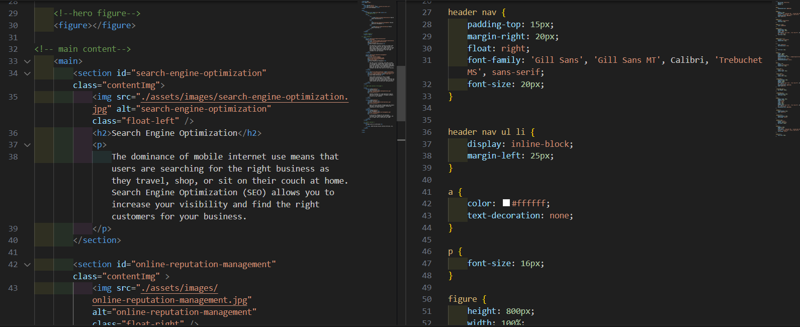

# code-refactor

#  header section

HTML semanics changed - header and nav
CSS - removed id class and edited element names 

# hero image and content section edit

HTML semanics used - figure , class , section , alt
CSS - removed id class and edited element names, deleted repetitive elements. 

# aside section edit

HTML semanics used - aside, class , section , alt, new class names
CSS - removed id class and edited element names to suit html elements, and deleted repetitive elements. 

# footer

HTML semanics used - footer ,  h4
CSS - removed id class and edited element names to suit html elements.

